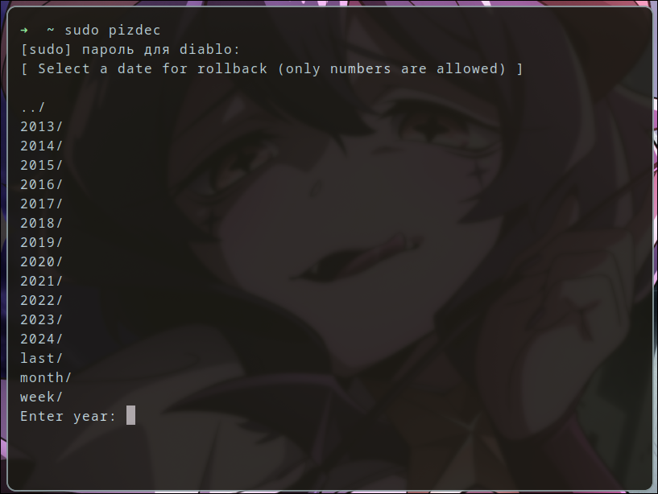

# archarchive
> The repository is considered obsolete<br />
> The new repository is [here](https://github.com/progzone122/archarchive)
___
#### A utility to quickly rollback an arch linux system using [ALA (a.k.a Arch Linux Archive)](https://wiki.archlinux.org/title/Arch_Linux_Archive)



https://github.com/govnorice/archarchive/assets/80642969/1dd9d71d-ed31-417f-a712-dd8b221ca68a

## I USE ARCH LINUX BTW?
Just install the package from the AUR, damn it!
```
yay -S archarchive
```

## HOW TO USE
### Date selection and system rollback:
```
sudo pizdec
```
